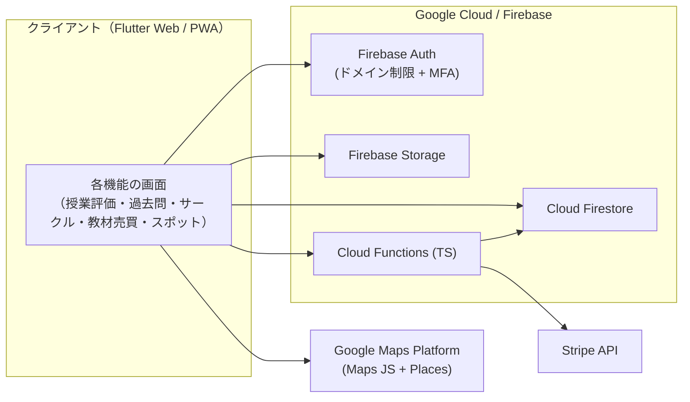

# 学内情報共有システム（SIT Spot）

芝浦工業大学（豊洲・大宮キャンパス）の学生向けに、学内のさまざまな情報を1つにまとめて共有するWebアプリケーションです。
授業評価・過去問・サークル・教材売買・おすすめスポットなどを横断的に扱い、在学生同士の情報共有を支援します。
6名チーム開発で、Flutter + Firebase で構築しています。

> **デモURL**: https://campus-info-share.web.app
> 利用には芝浦工大ドメインのメールアカウント＋多要素認証（MFA）でのログインが必要です。

---

## 主な機能

| 機能 | 概要 |
|---|---|
| ログイン・プロフィール | 芝浦工大ドメイン限定のアカウント作成／ログイン（MFA対応）、ユーザー名変更、投稿削除、ログアウト |
| 講義内容（授業評価） | 授業ごとの評価・レビューの閲覧・投稿 |
| サークル・部活動 | サークル情報の一覧・詳細・投稿 |
| 過去問 | 科目別の過去問の共有・閲覧 |
| 教材売買 | 教材の出品・購入（Stripe決済・通知連携） |
| おすすめスポット | キャンパス周辺スポットの検索・投稿・星評価付きレビュー（地図連携） |

各機能は共通のWebレイアウト（検索画面＋フィルタ、ボトムタブ）に統一しています。

---

## 技術スタック

| レイヤー | 技術 |
|---|---|
| フロントエンド | Flutter (Stable) / Dart — Web・Android・iOS 共通コード |
| バックエンド | Firebase Cloud Functions（TypeScript / ES2020+） |
| データベース | Cloud Firestore |
| ストレージ | Firebase Storage（過去問PDF・商品画像・スポット写真） |
| 認証 | Firebase Authentication（芝浦工大ドメイン制限 ＋ Authenticator による MFA） |
| 地図 | Google Maps Platform（Maps JavaScript API ＋ Places API） |
| 決済 | Stripe API（教材売買） |
| オフライン対応 | PWA（Service Worker）＋ Firestore キャッシュ |

---

## アーキテクチャ概要



- データアクセスは Firestore / Storage の**セキュリティルール**で保護（読み取りは公開、投稿・編集・削除は本人のみ）。
- スポットの星評価は各レビューから `averageRating` / `reviewCount` をトランザクションで集計。

---

## 動作環境

- **基本**: Webブラウザ（レスポンシブ対応 / PC 1920×1080 以上・スマホ 375×667 以上）
- 対応OS: Windows 10/11、macOS Big Sur 以降、Android 10 以降、iOS 14 以降
- **将来**: スマートフォンアプリ（Android / iOS）展開

---

## ローカルでの実行

```bash
# 1. 依存パッケージの取得
flutter pub get
```

Google Maps を利用するため、`lib/secrets.dart` を各自で作成してください（このファイルは `.gitignore` 済み）。

```dart
// lib/secrets.dart
const String googleMapsApiKey = 'あなたのGoogle Maps APIキー';
```

```bash
# 2. Web で起動（まず動作確認はこちら）
flutter run -d chrome

# 3. 本番ビルド
flutter build web
```

> Firestore などバックエンドとの通信は、大学ネットワーク（VPN）環境での利用を想定しています。

---

## ディレクトリ構成（抜粋）

```
lib/
├── main.dart
├── mainscreen.dart        # ボトムタブのホーム
├── firebase_options.dart
├── C1/, C2/, C3/, C5/     # ログイン・認証・プロフィール関連
├── lecture/               # 講義内容（授業評価）
├── past/                  # 過去問
├── payment/               # 教材売買（Stripe 決済）
├── features/spot/         # おすすめスポット（検索・詳細・投稿）
├── models/                # データモデル
├── services/              # Firestore / Storage / 各種CRUD
├── repositories/          # 外部API（Maps 等）ラッパ
└── shared/                # 共通ユーティリティ・例外

docs/                      # 設計書（要求仕様書・内部/外部設計書 ほか）
functions/                 # Firebase Cloud Functions (TypeScript)
firestore.rules            # Firestore セキュリティルール
storage.rules              # Storage セキュリティルール
```

---

## チーム構成（6名 / 学内PBL）

6名がそれぞれ機能単位で担当し、共通のUI・データ設計方針のもとで開発しています。

- ログイン・プロフィール
- 講義内容（授業評価）
- サークル・部活動
- 過去問
- 教材売買
- おすすめスポット

## コーディング規約

Dart 公式のスタイルガイド **[Effective Dart](https://dart.dev/effective-dart)** に準拠します。

これを機械的に担保するため、静的解析に **`flutter_lints`**（Effective Dart／公式lintベースの推奨ルールセット）を採用しています（`analysis_options.yaml` で有効化）。
開発時は **Dart Analyzer**（`flutter analyze`）による警告（Warnings）・エラー（Errors）が出ないようにコードを記述してください。

---

## 備考

- 本リポジトリは芝浦工業大学の学内プロジェクト（PBL）として開発したものです。
- 詳細な仕様・設計は `docs/`（要求仕様書・内部設計書・外部設計書）を参照してください。
